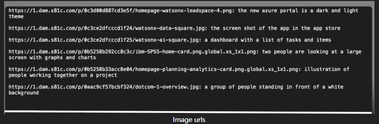

`pip install gradio`

Here's how image captioning AI can make a difference:

- Improves accessibility: Helps visually impaired individuals understand visual content.
- Enhances SEO: Assists search engines in identifying the content of images.
- Facilitates content discovery: Enables efficient analysis and categorization of large image databases.
- Supports social media and advertising: Automates engaging description generation for visual content.
- Boosts security: Provides real-time descriptions of activities in video footage.
- Aids in education and research: Assists in understanding and interpreting visual materials.
- Offers multilingual support: Generates image captions in various languages for international audiences.
- Enables data organization: Helps manage and categorize large sets of visual data.
- Saves time: Automated captioning is more efficient than manual efforts.
- Increases user engagement: Detailed captions can make visual content more engaging and informative.

## Step by step guide:

- Implement an image captioning tool using the BLIP model from Hugging Face's Transformers

- Use Gradio to provide a user-friendly interface for image captioning application

- Adapt the tool for real-world business scenarios, demonstrating its practical applications

in terminal:

```
pip3 install virtualenv
virtualenv my_env # create a virtual environment my_env
source my_env/bin/activate # activate my_env
```

install required libraries in the environment:

```
# installing required libraries in my_env
pip install langchain==0.1.11 gradio==4.44.0 transformers==4.38.2 bs4==0.0.2 requests==2.31.0 torch==2.2.1
```

After that, our environment is ready to create Python files.

## Scenario: How image captioning helps a business

## Business scenario on news and media:

A news agency publishes hundreds of articles daily on its website. Each article contains several images relevant to the story. Writing appropriate and descriptive captions for each image manually is a tedious task and might slow down the publication process.

In this scenario, your image captioning program can expedite the process:

Journalists write their articles and select relevant images to go along with the story.

These images are then fed into the image captioning program (instead of manually insert description for each image).

The program processes these images and generates a text file with the suggested captions for each image.

The journalists or editors review these captions. They might use them as they are, or they might modify them to better fit the context of the article.

These approved captions then serve a dual purpose:

Enhanced accessibility: The captions are integrated as alternative text (alt text) for the images in the online article. Visually impaired users, using screen readers, can understand the context of the images through these descriptions. It helps them to have a similar content consumption experience as sighted users, adhering to the principles of inclusive and accessible design.

Improved SEO: Properly captioned images with relevant keywords improve the article's SEO. Search engines like Google consider alt text while indexing, and this helps the article to appear in relevant search results, thereby driving organic traffic to the agency's website. This is especially useful for image search results.

Once the captions are approved, they are added to the images in the online article.

By integrating this process, the agency not only expedites its publication process but also ensures all images come with appropriate descriptions, enhancing the accessibility for visually impaired readers, and improving the website's SEO. This way, the agency broadens its reach and engagement with a more diverse audience base.

## Let's implement automated image captioning tool

We implement an automated image captioning program that works directly from a URL. The user provides the URL, and the code generates captions for the images found on the webpage. The output is a text file that includes all the image URLs along with their respective captions (like the image below). To accomplish this, you use BeautifulSoup for parsing the HTML content of the page and extracting the image URLs.


