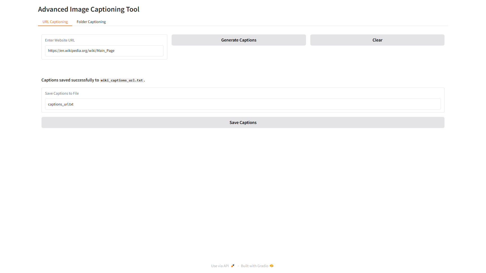
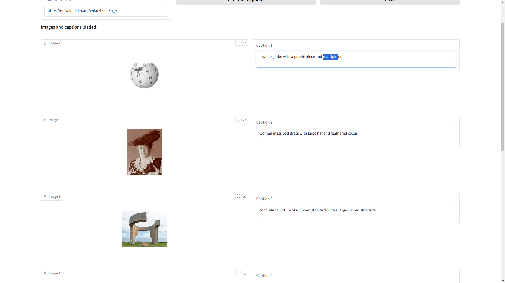
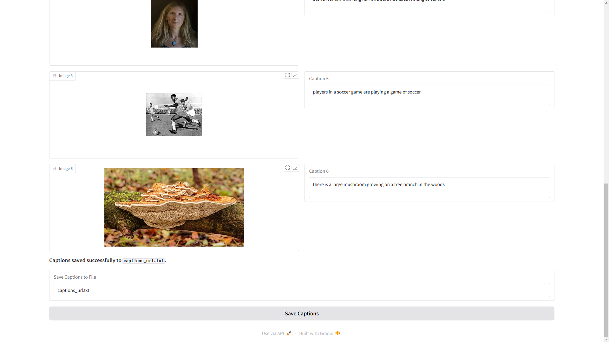
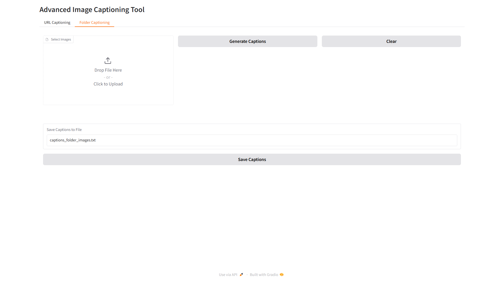
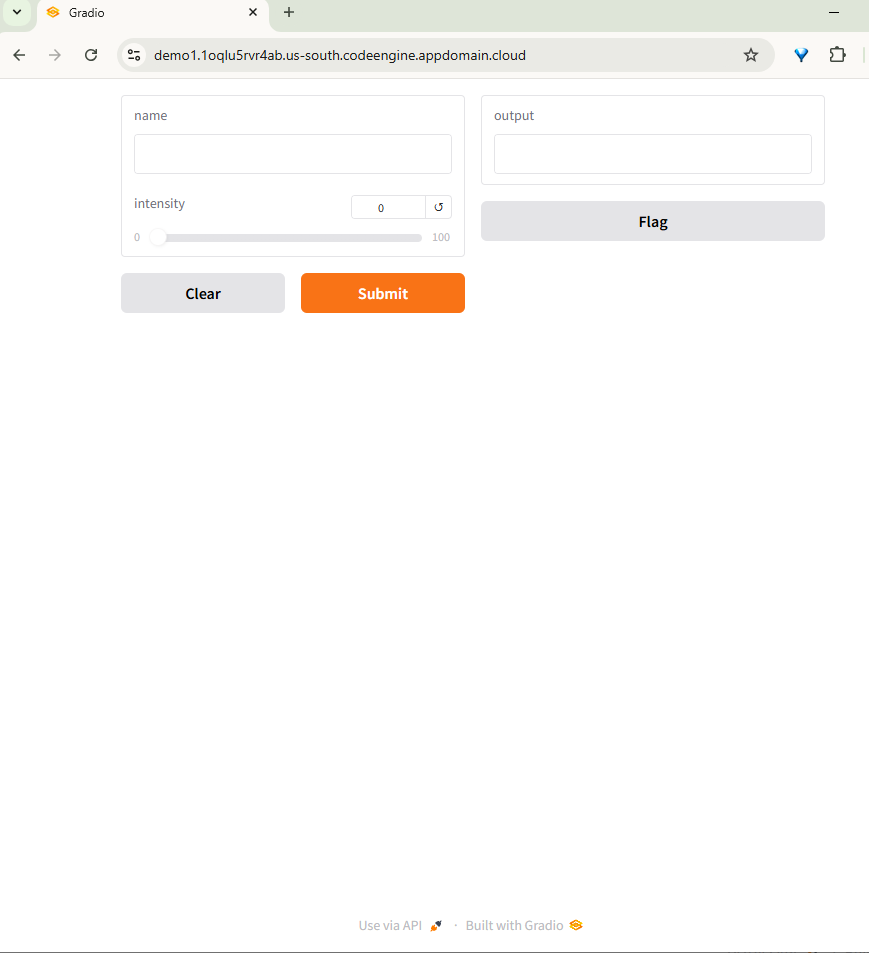
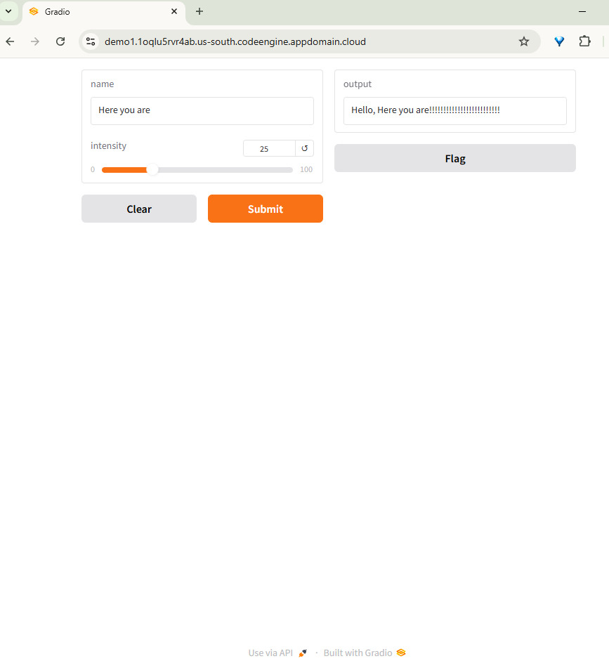

# Automated Image Captioning with AI

## Table of Contents
- [Project Overview](#project-overview)
- [Key Features](#key-features)
- [Practical Applications](#practical-applications)
- [Development Process](#development-process)
- [Usage Instructions](#usage-instructions)
- [Visuals](#visuals)
- [Contributing](#contributing)
- [Future Enhancements](#future-enhancements)
- [Acknowledgements](#acknowledgements)
- License
- [Deploy the App with IBM Cloud and IBM Code Engine](#deploy-the-app-with-ibm-cloud-and-ibm-code-engine)

## Project Overview
The **Automated Image Captioning with AI** project is designed to automatically generate descriptive captions for images extracted from a given website URL or a local folder. Leveraging state-of-the-art machine learning models, this project provides an interactive web interface using Gradio, making it easy for users to input a URL or select images from a folder, generate captions, and save the results in any format to enable modifying later as well.


## Key Features
- **Image Extraction**: Automatically extracts image URLs from the provided website URL.
- **Caption Generation**: Utilizes the `Salesforce/blip-image-captioning-large` model to generate descriptive captions for each image.
- **Interactive Interface**: Provides a user-friendly interface using Gradio for easy interaction.
- **Modify Captions**: Allows users to edit the generated captions.
- **Save Captions**: Allows users to save the generated captions to a text file.
- **Clear Interface**: Includes a "Clear" button to reset the interface and clear all data.

## Practical Applications
- **Enhanced Accessibility**: Helps visually impaired individuals understand visual content through descriptive captions.
- **Improved SEO**: Assists search engines in identifying the content of images, improving the article's SEO.
- **Content Discovery**: Enables efficient analysis and categorization of large image databases.
- **Social Media and Advertising**: Automates engaging description generation for visual content.
- **Education and Research**: Assists in understanding and interpreting visual materials.
- **Data Organization**: Helps manage and categorize large sets of visual data.
- **Time-Saving**: Automated captioning is more efficient than manual efforts.
- **User Engagement**: Detailed captions can make visual content more engaging and informative.

## Development Process
### Situation
**Business scenario on news and media:**

A news agency publishes hundreds of articles daily, each containing several images relevant to the story. Writing appropriate and descriptive captions for each image manually is a tedious task and might slow down the publication process. The agency needed a solution to expedite this process while ensuring the captions were accurate and contextually relevant.

### Task
Our task was to develop an automated image captioning tool that could generate descriptive captions for images extracted from a given website URL or a folder. The tool needed to be user-friendly, efficient, and capable of producing high-quality captions that enhance accessibility and improve SEO.

### Action
We implemented an automated image captioning program that works directly from a URL or a folder. The user provides the URL or selects images from a folder, and the code generates captions for the images found. The output is a text file that includes all the image URLs or image file names along with their respective captions.

### Result
By integrating this automated image captioning tool, the news agency is able to expedite its publication process significantly. The tool ensures that all images come with appropriate descriptions, enhancing accessibility for visually impaired readers and improving the website's SEO. This broadens the agency's reach and engagement with a more diverse audience base.

## Usage Instructions
### Installation
1. **Clone the Repository:**
   ```bash
   git clone https://github.com/prgrmcode/caption_photos_with_GenAI.git
   cd caption_photos_with_GenAI
   ```

2. **Install Dependencies:**
   ```bash
   pip install -r requirements.txt
   ```

3. **Run the Application:**
   ```bash
   python image_captioner_advanced.py
   ```

### Step-by-Step Guide
1. **Enter Website URL:**
   - Input the URL of the website containing images you wish to caption.
   - 

2. **Generate Captions:**
   - Click the "Generate Captions" button to start the process.

3. **Review and Edit Captions:**
   - Once processing is complete, images and their captions will be displayed. You can modify the captions as needed.
   - 

4. **Save Captions:**
   - Click the "Save Captions" button to save the modified captions to a text file.
   - 

5. **Clear Interface:**
   - Click the "Clear" button to reset the interface and clear all data.

## Visuals

### URL Captioning Interface


### Folder Captioning Interface



## Contributing
Contributions are welcome! Please feel free to submit a Pull Request or open an Issue to improve the project.

### How to Contribute
1. **Fork the Repository:**
   - Click the "Fork" button at the top right corner of the repository page.

2. **Clone the Forked Repository:**
   ```bash
   git clone <your_forked_repository_url>
   cd <repository_name>
   ```

3. **Create a New Branch:**
   ```bash
   git checkout -b <branch_name>
   ```

4. **Make Your Changes:**
   - Implement your changes and commit them with a descriptive message.

5. **Push Your Changes:**
   ```bash
   git push origin <branch_name>
   ```

6. **Create a Pull Request:**
   - Go to the original repository and click the "New Pull Request" button.

## Future Enhancements
### Multilingual Support
Expanding the tool to support multiple languages can make it more versatile and useful for international audiences.

### Real-Time Captioning
Integrating real-time captioning capabilities can enhance the tool's applicability in live events and streaming platforms.

### Advanced Customization
Allowing users to customize the captioning model and parameters can provide more control over the generated captions, catering to specific needs and preferences.

## Acknowledgements
- **Gradio:** For providing an easy-to-use interface for machine learning applications.
- **Transformers:** For the powerful pre-trained models.
- **Pillow:** For image processing capabilities.
- **Requests:** For handling HTTP requests.
- **BeautifulSoup:** For parsing HTML and extracting image URLs.

## License
This project is licensed under the MIT License.


## Deploy the app with IBM Cloud and IBM Code Engine

### Benefits of Using IBM Code Engine
- **Scalability**: Automatically scales your application based on demand.
- **Simplicity**: Simplifies the deployment process with a fully managed, serverless platform.
- **Serverless Features**: Eliminates the need to manage infrastructure, allowing you to focus on your application.

Deploying your application on IBM Cloud using IBM Code Engine allows you to run your containerized workloads seamlessly. Follow these steps to deploy your app:

### Step-by-Step Deployment Guide

#### Step 1: Create the Container Image

1. **Create a Directory for Your App:**
   ```bash
   mkdir myapp
   cd myapp
   ```

2. **Create Required Files:**
   ```bash
   touch demo.py Dockerfile requirements.txt
   ```

3. **Create [requirements.txt](myapp/requirements.txt):**
   List all the dependencies your app needs. You can use `pip freeze` to generate this file.
   ```bash
   pip freeze > requirements.txt
   ```

4. **Create `demo.py`:**
   Write a simple Gradio web application in this file.

5. **Create `Dockerfile`:**
   ```dockerfile
   FROM python:3.10

   WORKDIR /app
   COPY requirements.txt requirements.txt
   RUN pip3 install --no-cache-dir -r requirements.txt

   COPY . .
   CMD ["python", "demo.py"]
   ```


#### Step 2: Build and Push the Container Image

1. **Log in to IBM Cloud:**
   ```bash
   ibmcloud login
   ```

2. **Target the appropriate region and resource group:**
   ```bash
   ibmcloud target --cf
   ```

3. **Create a Code Engine project:**
   ```bash
   ibmcloud ce project create --name myproject
   ```

4. **Set the project context:**
   ```bash
   ibmcloud ce project select --name myproject
   ```

5. **Build the container image:**
   ```bash
   ibmcloud ce build create --name build-local-dockerfile --build-type local --size large --image us.icr.io/${SN_ICR_NAMESPACE}/myapp --registry-secret icr-secret
   ```

6. **Submit and run the build configuration:**
   ```bash
   ibmcloud ce buildrun submit --name buildrun-local-dockerfile --build build-local-dockerfile --source .
   ```

#### Step 3: Deploy the Containerized App

1. **Create the application:**
   ```bash
   ibmcloud ce application create --name demo --image us.icr.io/${SN_ICR_NAMESPACE}/myapp --registry-secret icr-secret --es 2G --port 7860 --minscale 1
   ```

2. **Access your application:**
   ```bash
   ibmcloud ce app get --name demo --output url
   ```

This means your app has been deployed and you can access it now! To obtain the URL of your app, run ```ibmcloud ce app get --name demo1 --output url```.

Click on the URL returned, and you should be able to see your app running in your browser!





### Troubleshooting Tips
- **Check Build Status**: Use `ibmcloud ce buildrun get -n buildrun-local-dockerfile` to monitor the build progress.
- **Verify Application Logs**: Use `ibmcloud ce application logs --name demo` to check the application logs for any errors.
- **Consult IBM Documentation**: Refer to the [IBM Code Engine Documentation](https://cloud.ibm.com/docs/codeengine) for detailed guidance and troubleshooting.

### Conclusion

Deploying your application on IBM Cloud using Gradio and IBM Code Engine is a seamless process that leverages the power of containerization and serverless technology. This comprehensive guide has walked you through creating a container image, building and pushing the image, and deploying the application on IBM Code Engine. By following these steps, you can ensure a scalable, efficient, and professional deployment for your AI-powered image captioning tool.

**This comprehensive process, from local testing to cloud deployment, highlights the seamless integration of Gradio, Docker, and IBM Code Engine, culminating in a successful application deployment on IBM Cloud.**

